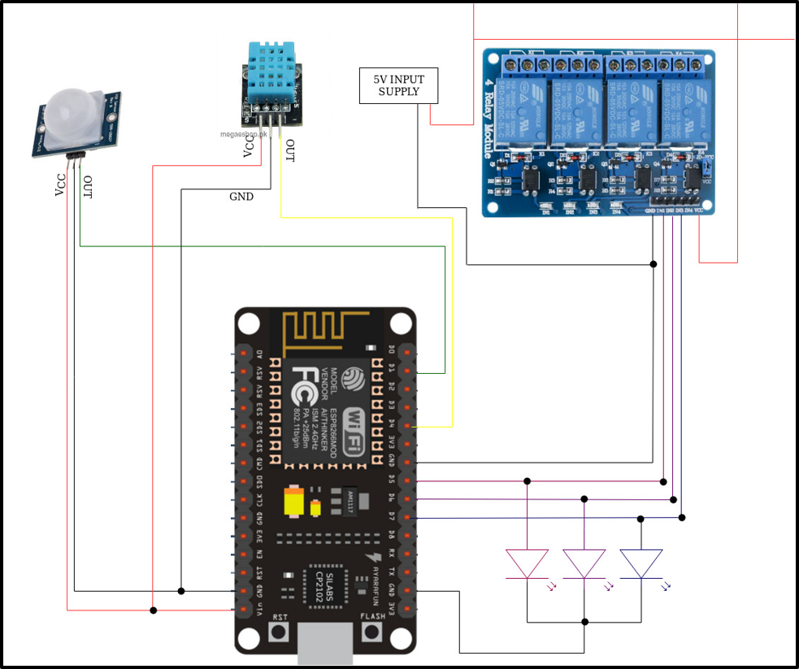

# Automatic Classroom Lighting and Fan Control System

## Overview

Most educational institutions still rely on traditional manual lighting and fan control systems, often leading to energy wastage when rooms are left unattended. Our project addresses this issue by implementing an **automated classroom environment management system** using a microcontroller, sensors, and relays.

This system detects human presence to intelligently control lights and regulates fan speed based on the ambient temperature. The objective is to promote efficient energy usage in classrooms with minimal human intervention.

---

## Features

- **Automatic Light Control**:  
  Lights are turned **ON** or **OFF** depending on the presence of individuals using Passive Infrared (PIR) sensors.

- **Zoned Lighting**:  
  The classroom is divided into **grids**, enabling selective lighting based on occupancy in each zone.

- **Temperature-Based Fan Control**:  
  A DHT11 temperature and humidity sensor monitors the environment. Fan speed or switching is automatically adjusted using a relay module based on the temperature.

---

## Hardware Components

- **ESP8266 NodeMCU** (Microcontroller Unit)  
- **PIR Motion Sensor** (for presence detection)  
- **DHT11 Sensor** (for temperature and humidity monitoring)  
- **4-Channel Relay Module** (for controlling lights and fan)  
- **LED Indicators** (to simulate lighting loads in testing)  
- **5V DC Power Supply**

---

## Circuit Diagram

### Diagram Analysis

- **Microcontroller**:  
  The NodeMCU ESP8266 acts as the central processing unit, reading sensor data and activating relays accordingly.

- **PIR Sensor**:  
  Connected to one of the digital GPIO pins. It detects motion and sends a HIGH signal when human presence is sensed.

- **DHT11 Sensor**:  
  Measures temperature and humidity. Its output is read by the NodeMCU to determine whether to activate the fan relay.

- **Relay Module**:  
  Connected to digital pins of the NodeMCU and powered by an external 5V supply. Each relay channel is capable of switching high-current devices like fans and lights.

- **LEDs**:  
  Used to simulate loads in this prototype. Each LED represents a zone light or a fan. These are connected to the output of the relay module.

---

## Repository Structure

- `circuit_diagram.png` — Circuit layout of the project  
- `main.ino` — Arduino source code for NodeMCU control logic  
- `README.md` — Project documentation (this file)  

---

## Contributors

This project was designed and developed as part of our Bachelor's curriculum by:

- Aashik M S ([iamaashikms](https://github.com/iamaashikms))  
- Desly Dominic  
- Krishnapriya V C  
- Jathindas A M

---

## License

This project is open-source and available under the MIT License.

---

